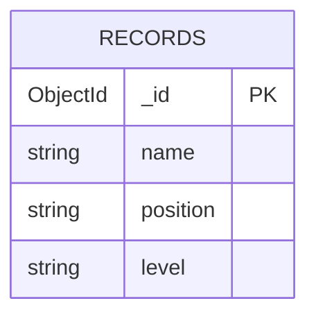

# EDD — Entity Document Diagram

Data model for the **MERN Stack Employee Records App**.

- **Database**: `employees`
- **Driver**: MongoDB Node.js Driver 6

---

## Entities

### Record    [collection: records]    [indexes: {_id:1}]

```
_id:       ObjectId
name:      string        # employee full name
position:  string        # job title / role
level:     string        # seniority level, e.g. "junior", "mid", "senior"
```

---

## Relationships

```
records  — standalone collection, no references to other collections
```

---

## Mermaid Diagram



---

## Notes

- No validation schema is enforced at the database level, and the current Express routes (`mern/server/routes/record.js`) do not enforce request-body validation.
- `level` is a free-form string. Typical values used in the seed data: `junior`, `mid`, `senior`.
- The application convention expects `name`, `position`, and `level`, but these fields are not currently enforced by backend validation.
